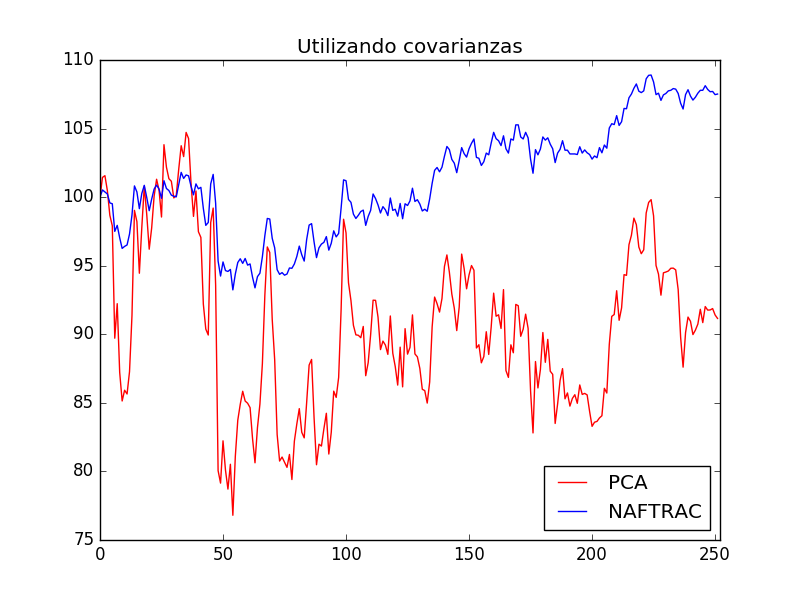
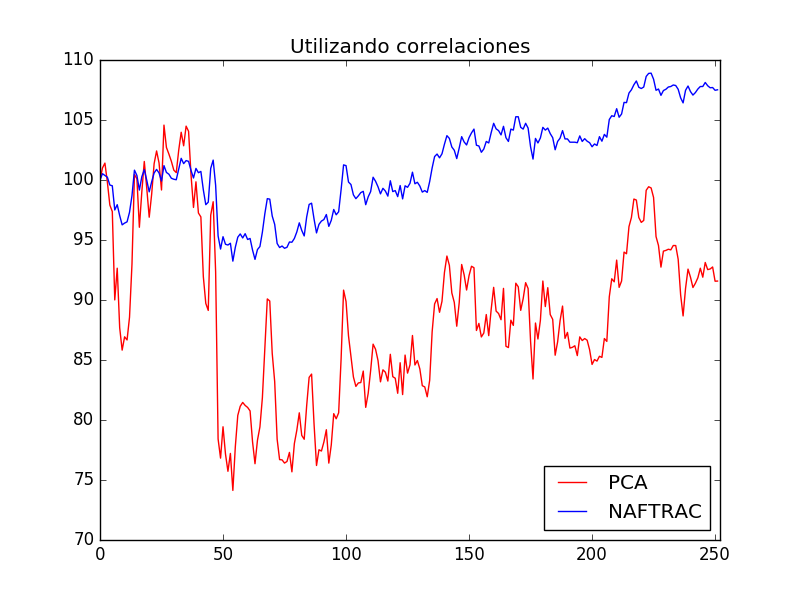

<!-- $theme: gaia -->
<!--page_number:true-->

# Creación de índices utilizando PCA

David Ricardo Montalván Hernández

13 de marzo de 2018

---

### Objetivo

Partiendo únicamente de los rendimientos diarios de un grupo de $10$ acciones, construir un índice que represente el valor de todas ellas utilizando un sólo número, es decir, reducir $10$ dimensiones a una sola.

---

### Un poco sobre el NAFTRAC

* El Índice de Precios y Cotizaciones (IPC) principal indicador del mercado accionario mexicano.
* El NAFTRAC busca replicar al IPC, **el IPC no se compra/vende, el NAFTRAC si**.
* $NAFTRAC_{t}=\frac{IPC_{t}}{1000}$

---

### Un poco sobre el NAFTRAC (Continúa)

* El IPC utiliza una metodología compleja para seleccionar la ponderación de cada acción, mas aún, utiliza información privada que no es accesible para el público general (no es replicable).

* Por lo tanto, es de utilidad tener un indicador alternativo.

---

### Datos
Se utilizaron precios de cierre diario para las $10$ acciones con mayor ponderación que forman parte del Índice de Precios y Valores (NAFTRAC) de la Bolsa Mexicana de Valores.

La ventana de tiempo para estos datos fue del *1-Septiembre-2016* al *31-Ago-2017*

---

### Datos (Continúa)
Iniciando el día *2-Septiembre-2016* se calculó, para cada serie accionaria, el cambio diario en los precios de la siguiente forma:

$$\Delta P_{t}=\dfrac{P_{t}-P_{t-1}}{P_{t-1}}$$

con dicha información se creó una matriz $M$ de tamaño $251 \times 10$, la cual fue la entrada para el algoritmo de *PCA*.

---

### Resultados

Dada la naturaleza de los datos, se realizaron dos versiones del algoritmo *PCA*:

* Utilizando la matriz de covarianzas.

* Utilizando la matriz de correlaciones.

==**Aclaración**==
No se está buscando replicar al *NAFTRAC*, como se mencionó, debido a la información utilizada esto no es posible.

---

### Resultados (Continúa)

==Utilizando la matriz de covarianzas==

---

### Resultados (Continúa)

==Utilizando la matriz de correlaciones==

---

### Conclusiones

* La matriz de correlaciones  genera un índice menos volátil y que representa de mejor forma la dirección del mercado.

* La metodología del algoritmo *PCA* resulta de utilidad si se busca construir indicadores para la **dirección** del mercado.

* Desafortunadamente, dicha metodología carece de interpretación en cuanto a las ponderaciones de cada acción.

---

# Algoritmo apriori para detectar reglas de asociación en el mercado accionario mexicano.

---

### Objetivo

Encontrar reglas de asociación entre series accionarias que cotizan en la Bolsa Mexicana de Valores.

---

### Descripción de los datos

Para cada serie accionaria se calcularon las variaciones diarias de los precios de cierre, $\Delta_{t}$, de la siguiente manera

$$\Delta_{t}=\dfrac{P_{t}-P_{t-1}}{P_{t-1}}$$

en donde $P_{t}$ es el precio de cierre en el día $t$.

Una vez obteniéndose estas variaciones, se procedió a etiquetarlas de acuerdo al signo de $\Delta_{t}$:

---

### Descripción de los datos (Cont'd)

* Si $\Delta_{t}<0$, entonces la etiqueta para la acción $K$ es *Baja_AcciónK*.

* Si $\Delta_{t}>0$, entonces la etiqueta para la acción $K$ es *Sube_AcciónK*.

* Si $\Delta_{t}=0$, entonces la etiqueta para la acción $K$ es *Neutral_AcciónK*.

---

### Descripción de los datos (Cont'd)

Por ejemplo:

|Día|AMXL|CEMEX|
|---|----|-----|
|1|Sube_AMXL|Baja_CEMEX
|2|Baja_AMXL|Baja_CEMEX|
|3|Sube_AMXL|Sube_CEMEX|

Cada día es una "transacción".

---

### Descripción de los datos (Cont'd)

Finalmente, el periodo de entrenamiento fue del 2 de enero de 2014 al último día hábil de diciembre de 2017.

El periodo de prueba abarcó del 2 de enero al 7 de marzo de 2018.

---

### Resultados

---

### Conclusiones

* El algoritmo *apriori* depende fuertemente del umbral mínimo para el soporte/confianza.

* Lo anterior nos lleva a preguntarnos ¿Cuál es un buen valor para los umbrales?

* Además, para este caso de estudio, podemos ver la importancia de tener distintas métricas de desempeño.